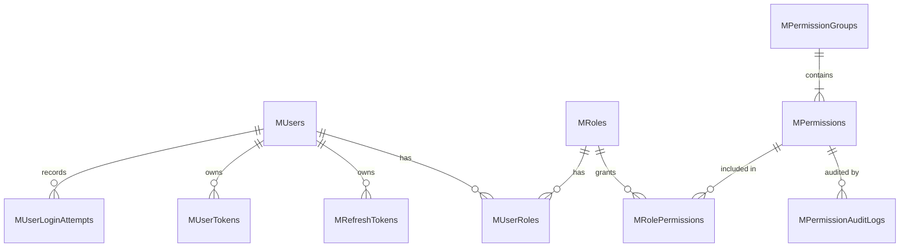

# Database Structure

This guide lists the default database tables created by Muonroi Building Block and how they relate to each other. All tables are added to your `DbContext` and created when migrations run.

## Identity and Permission Tables

| Table | Purpose | Optional |
| --- | --- | --- |
| **MUsers** | Stores user account information. |  |
| **MRoles** | List of roles. |  |
| **MPermissions** | Permission definitions mapped to enum values. |  |
| **MRolePermissions** | Link between roles and permissions. |  |
| **MUserRoles** | Link between users and roles. |  |
| **MRefreshTokens** | Stores refresh tokens and validity keys. |  |
| **MUserTokens** | External login tokens (OAuth, etc.). | ✔️ |
| **MUserLoginAttempts** | Tracks failed login attempts. | ✔️ |
| **MLanguages** | Supported locale codes for localization. |  |
| **MPermissionGroups** | Groups permissions by module. |  |
| **MPermissionAuditLogs** | Audit trail of permission changes. | ✔️ |

Tables marked as optional are created but only populated when the corresponding feature is enabled (for example, external authentication or permission auditing).

## Relationships

Use the [Permission Guide](permission-guide.md) for details on how permissions are defined and enforced.
